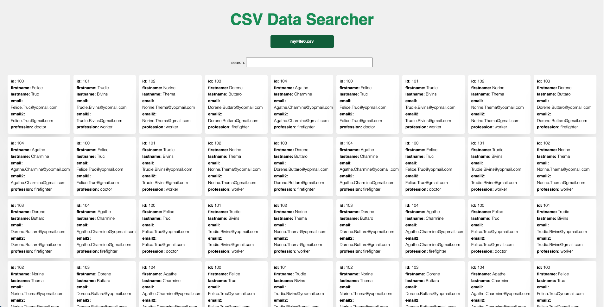

<h1 align="center">Shaw and Partners Challenge 💚</h1>



<div align="center">

This project is designed to test my knowledge of full-stack web technologies and assess my ability to create front and back-​end with attention to details, cross-browser compatibility, standards, and reusability.

</div>

## ✨ Features

- Complete Styled CSV Data Viewer.
    - Attach a CSV file.
    - Search throught it.
- CSV Data Reader API.
    - Read and extract data from a CSV file.
    - Filter data.

<h1>🌈 Front-end</h1> 

## 🖥 Environment Support

- Modern browsers

| [](http://godban.github.io/browsers-support-badges/)<br>Edge | [](http://godban.github.io/browsers-support-badges/)<br>Firefox | [](http://godban.github.io/browsers-support-badges/)<br>Chrome | [](http://godban.github.io/browsers-support-badges/)<br>Safari |
| ---------------------------------------------------------------------------------------------------------------------------------------------------------------------------------------------------- | ---------------------------------------------------------------------------------------------------------------------------------------------------------------------------------------------------------------- | ------------------------------------------------------------------------------------------------------------------------------------------------------------------------------------------------------------ | ------------------------------------------------------------------------------------------------------------------------------------------------------------------------------------------------------------ |
| Edge                                                                                                                                                                                                 | last 2 versions                                                                                                                                                                                                  | last 2 versions                                                                                                                                                                                              | last 2 versions                                                                                                                                                                                              |

## 📦 Running Locally

First, Install the node_modules

```bash
$ npm install
```

Then,

```bash
$ npm run dev
```

Finally, open your browser and visit http://localhost:4000/

## ⌨️ Development

- Conventional Commits - This repo uses [conventional commits](https://www.conventionalcommits.org/en/v1.0.0-beta.3/) to standardize commit messages and auto generate a changelog throughout the development cycle.
- Atomic Design - This repo uses [atomic design](https://bradfrost.com/blog/post/atomic-web-design/) to standardize the components structure.

## 🛠️ Libraries and Tools

- Typescript
- Jest
- Sass
- Eslint
- React Router DOM

<h1>🧠 Back-end</h1> 

## 📦 Running Locally

First, Install the node_modules

```bash
$ npm install
```

Then,

```bash
$ npm run dev
```

Finally, open your HTTP Request tool.

## ⌨️ Development

- Conventional Commits - This repo uses [conventional commits](https://www.conventionalcommits.org/en/v1.0.0-beta.3/) to standardize commit messages and auto generate a changelog throughout the development cycle.
- Clean Architecture
  - Single Responsibility Principle (SRP)
  - Open Closed Principle (OCP)
  - Interface Segregation Principle (ISP)
  - Dependency Inversion Principle (DIP)
  - Separation of Concerns (SOC)
  - Don't Repeat Yourself (DRY)
  - You Aren't Gonna Need It (YAGNI)
  - Keep It Simple, Silly (KISS)
  - Small Commits

## 🛠️ Libraries and Tools

- Typescript
- Jest
- Express
- Supertest
- Eslint
- Sucrase
- Multer

## ✅ Endpoints

### **Request**

`GET /api/users`

    curl --location 'http://localhost:3000/api/users?q=gmail'

**Query String - Filter**

- q

### **Response**

    [
        {
            "name": "any_name",
            "city": "any_city"           
        },
    ]

OBS: the response will be according from the CSV file.

### **Request**

`POST /api/files`

    curl --location 'http://localhost:3000/api/files' \
    --header 'content-Type: multipart/form-data' \
    --form 'file=@"{file_directory}"'

### **Response**

    [
        {
            "name": "any_name",
            "city": "any_city"           
        },
    ]

OBS: the response will be according from the CSV file.


## 🤝 Contributing

<table>
  <tr>
    <td align="center">
      <br />      
      <sub>
        <b>Leonardo Arruda</b>
      </sub>      
      <br />
    </td>
  </tr>
</table>

Follow me on <a href="https://github.com/LeonardoArrudaMesquita">Github</a> and <a href="https://www.linkedin.com/in/leonardo-arruda-40053b146/">Linkedin</a>!
